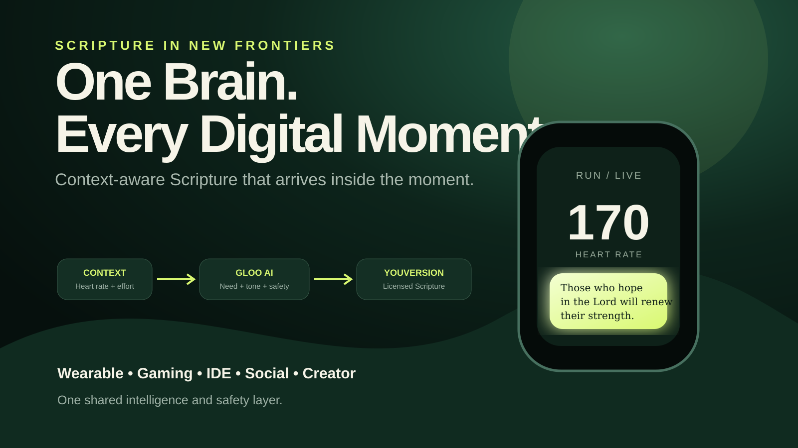

# Scripture Everywhere AI

**One Brain. Every Digital Moment.**

A working prototype for **Scripture in New Frontiers**. It detects meaningful moments across wearables, gaming, developer IDEs, social communities, and creator tools, then uses **Gloo AI Studio** to understand the human need and **YouVersion Platform API** to retrieve Scripture for a safe, native delivery moment.



## Judge path

1. **Public demo:** https://o-yutaka.github.io/popopo/
2. **Timed 2:59 judge story:** https://o-yutaka.github.io/popopo/video.html?autoplay=1
3. **Public Kaggle notebook:** [`notebooks/scripture_everywhere_submission.ipynb`](notebooks/scripture_everywhere_submission.ipynb)
4. **Media Gallery assets:** [`media/cover.png`](media/cover.png) and [`media/architecture.png`](media/architecture.png)
5. **Live API evidence:** [`evidence/`](evidence/) — the JSON proof appears only after a real Gloo + YouVersion run succeeds.
6. **Kaggle writeup and final checklist:** [`SUBMISSION.md`](SUBMISSION.md)

## Hero story: the runner

The judge video shows the interaction rather than only describing it:

```text
Heart rate 170 + effort 85%
  ↓
SIGNAL DETECTED
  ↓
Local consent / crisis / privacy / cooldown preflight
  ↓
WAITING FOR RECOVERY — no interruption mid-stride
  ↓
Quiet haptic cue
  ↓
Runner raises wrist
  ↓
Scripture card appears with demo/live attribution clearly labeled
```

The other four frontiers are connectors to the same shared intelligence and safety layer—not separate apps.

## Why this matters

People already live inside workouts, games, IDEs, social feeds, and creator tools. Existing experiences usually require them to leave that environment and open another app. Scripture Everywhere AI makes the encounter timely and native while protecting consent, privacy, and human judgment.

## Architecture

```text
Connector Event
  ↓
Local consent / crisis / cooldown preflight
  ↓
Gloo OAuth2 client credentials → short-lived bearer token
  ↓
Gloo Completions V2: need / bounded theme / tone / safety
  ↓
Theme Allowlist → canonical USFM passage ID
  ↓
YouVersion Platform: X-YVP-App-Key + passage + Bible attribution
  ↓
Delivery Policy: timing / privacy / dismiss / cooldown
  ↓
Wearable card / respawn screen / IDE margin / private review / creator overlay
```

## Working implementation

- Responsive static product demo
- Clean **179-second** judge video with a one-second upload buffer
- Three-stage runner interaction: detect → wait → reveal
- Recording mode hides timer, pause button, keyboard hints, and progress controls
- Final public-demo CTA and repository link
- Dynamic evidence card that shows live verification only when a real evidence JSON exists
- FastAPI orchestration backend
- Typed, strict Pydantic contracts
- Official Gloo OAuth2 client-credentials exchange with required `api/access` scope
- Gloo Completions V2 at `/ai/v2/chat/completions`
- Official YouVersion passage retrieval and Bible attribution
- Deterministic credential-free judging fallback
- Consent and crisis suppression before sponsor calls
- Public-social auto-post prevention and pseudonymous cooldown
- Automated API, OAuth, media, notebook, word-count, video-duration, CTA, attribution, and clean-record-mode tests
- GitHub Actions CI, Pages deployment, video rendering, PNG rendering, and live-evidence workflows
- Docker backend, complete Kaggle notebook, and upload-ready PNG assets

## Demo mode versus live mode

The public interface remains reproducible without private credentials. It demonstrates the contracts and interaction but must not be represented as proof of sponsor API execution.

Live mode requires:

```env
GLOO_CLIENT_ID=...
GLOO_CLIENT_SECRET=...
YVP_APP_KEY=...
```

The evidence workflow requires both sponsor calls in one request and commits only redacted proof. The video loads that proof when present; otherwise it explicitly labels the live gate as separate.

## Run locally

```bash
python -m http.server 8000
```

Open:

- Product demo: `http://localhost:8000/`
- Interactive judge story: `http://localhost:8000/video.html?autoplay=1`
- Clean recording mode: `http://localhost:8000/video.html?autoplay=1&record=1`

Backend:

```bash
cd backend
python -m venv .venv
source .venv/bin/activate  # Windows: .venv\Scripts\activate
pip install -r requirements.txt
cp .env.example .env
uvicorn app:app --reload
```

Tests:

```bash
cd backend
pytest -q
```

## Safety and privacy

- Explicit user opt-in is required.
- Crisis and self-harm signals suppress ordinary automated delivery and route to human support.
- Sensitive public social content is never auto-posted.
- The system does not diagnose or claim divine certainty.
- Cooldowns and user controls prevent notification fatigue.
- Raw biometrics and private text are not retained by the prototype.

## Repository map

```text
index.html                               public interactive demo
video.html                               clean 179-second interaction-first judge story
app.js / styles.css                      five-frontier UI
backend/app.py                           FastAPI orchestration
backend/clients.py                       Gloo OAuth2/V2 + YouVersion adapters
backend/policy.py                        consent, crisis and privacy gates
backend/tests/                           API, OAuth and submission-quality tests
backend/scripts/capture_live_evidence.py redacted real-API proof
notebooks/scripture_everywhere_submission.ipynb
media/cover.png                          Kaggle/YouTube cover image
media/architecture.png                   architecture gallery image
SUBMISSION.md                            writeup, links and submission gate
VIDEO_RECORDING.md                       narration and recording process
AUDIT.md                                 first-place readiness audit
```

## License

MIT. Scripture text and API-provided content remain subject to the respective platform terms.
