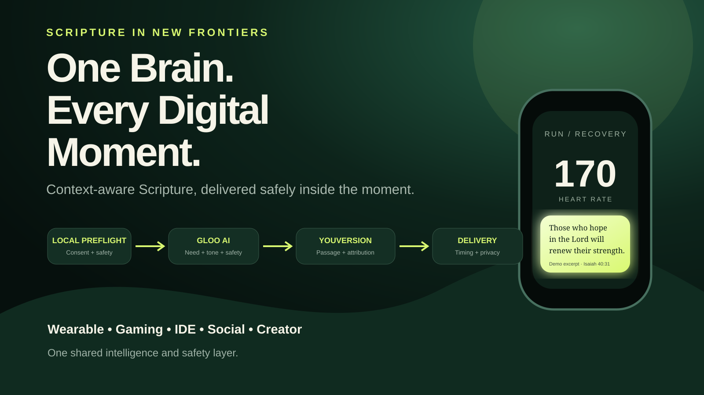

# Scripture Everywhere AI

**One Brain. Every Digital Moment.**

A working prototype for **Scripture in New Frontiers**. It detects meaningful moments across wearables, gaming, developer IDEs, social communities, and creator tools, then uses **Gloo AI Studio** to understand the human need and **YouVersion Platform API** to retrieve Scripture for a safe, native delivery moment.



## Judge path

1. **Public demo:** https://o-yutaka.github.io/popopo/
2. **Timed three-minute story:** https://o-yutaka.github.io/popopo/video.html?autoplay=1
3. **Public Kaggle notebook:** [`notebooks/scripture_everywhere_submission.ipynb`](notebooks/scripture_everywhere_submission.ipynb)
4. **Media Gallery assets:** [`media/cover.svg`](media/cover.svg) and [`media/architecture.svg`](media/architecture.svg)
5. **Live API evidence:** [`evidence/`](evidence/) — the JSON proof appears only after a real Gloo + YouVersion run succeeds.
6. **Kaggle writeup and final checklist:** [`SUBMISSION.md`](SUBMISSION.md)

## Hero story: the runner

A runner reaches a difficult physiological moment: heart rate 170, effort 85%, eighteen minutes into the session. The system does not interrupt mid-stride.

```text
Wearable context
  ↓
Gloo AI Studio
  need: endurance
  theme: strength
  tone: concise
  safe_to_deliver: true
  ↓
Theme allowlist → ISA.40.31
  ↓
YouVersion Platform API
  licensed Scripture passage
  ↓
Delivery Policy
  private haptic cue during recovery window
```

The other four frontiers are connectors to the same shared intelligence and safety layer—not separate apps.

## Why this matters

People already live inside workouts, games, IDEs, social feeds, and creator tools. Existing experiences usually require them to leave that environment and open another app. Scripture Everywhere AI makes the encounter timely and native while protecting consent, privacy, and human judgment.

## Architecture

```text
Connector Event
  ↓
Typed Context Normalizer
  ↓
Gloo AI Studio: need / bounded theme / tone / safety
  ↓
Theme Allowlist → canonical USFM passage ID
  ↓
YouVersion Platform API: passage retrieval
  ↓
Delivery Policy: consent / crisis / timing / privacy / cooldown
  ↓
Wearable card / respawn screen / IDE margin / private review / creator overlay
```

## Working implementation

- Responsive static product demo
- Exact 180-second recording experience
- FastAPI orchestration backend
- Typed Pydantic contracts
- Separate Gloo and YouVersion clients
- Official-style YouVersion passage retrieval by Bible ID and passage ID
- Deterministic credential-free judging fallback
- Consent and crisis suppression policy
- Public-social auto-post prevention
- Automated tests and GitHub Actions CI
- Docker backend
- Manual live-evidence workflow with public redacted proof
- Complete Kaggle notebook and media assets

## Demo mode versus live mode

The public interface remains reproducible without private credentials. It clearly demonstrates the same contracts and pipeline but must not be represented as proof of sponsor API execution.

Live mode is enabled only when the required Gloo and YouVersion credentials are configured. The workflow in `.github/workflows/live-evidence.yml` then performs a real wearable request, requires `mode=live`, requires `scripture.source=youversion`, removes the full passage text and secrets, and commits a redacted evidence file.

## Run locally

```bash
python -m http.server 8000
```

Open:

- Product demo: `http://localhost:8000/`
- Three-minute recording page: `http://localhost:8000/video.html?autoplay=1`

Backend:

```bash
cd backend
python -m venv .venv
source .venv/bin/activate  # Windows: .venv\Scripts\activate
pip install -r requirements.txt
cp .env.example .env
uvicorn app:app --reload
```

Tests:

```bash
cd backend
pytest -q
```

## Safety and privacy

- Explicit user opt-in is required.
- Crisis and self-harm signals suppress ordinary automated delivery and route to human support.
- Sensitive public social content is never auto-posted.
- The system does not diagnose or claim divine certainty.
- Cooldowns and user controls prevent notification fatigue.
- Raw biometrics and private text are not retained by the prototype.

## Repository map

```text
index.html                              public interactive demo
video.html                              exact 180-second recording experience
app.js / styles.css                     five-frontier UI
backend/app.py                          FastAPI orchestration
backend/clients.py                      Gloo + YouVersion adapters
backend/policy.py                       consent, crisis and privacy gates
backend/tests/                          automated contract tests
backend/scripts/capture_live_evidence.py redacted real-API proof
notebooks/scripture_everywhere_submission.ipynb
media/cover.svg                         Kaggle cover image
media/architecture.svg                  architecture gallery image
SUBMISSION.md                           writeup, links and submission gate
VIDEO_RECORDING.md                      exact narration and recording process
AUDIT.md                                first-place readiness audit
```

## License

MIT. Scripture text and API-provided content remain subject to the respective platform terms.
